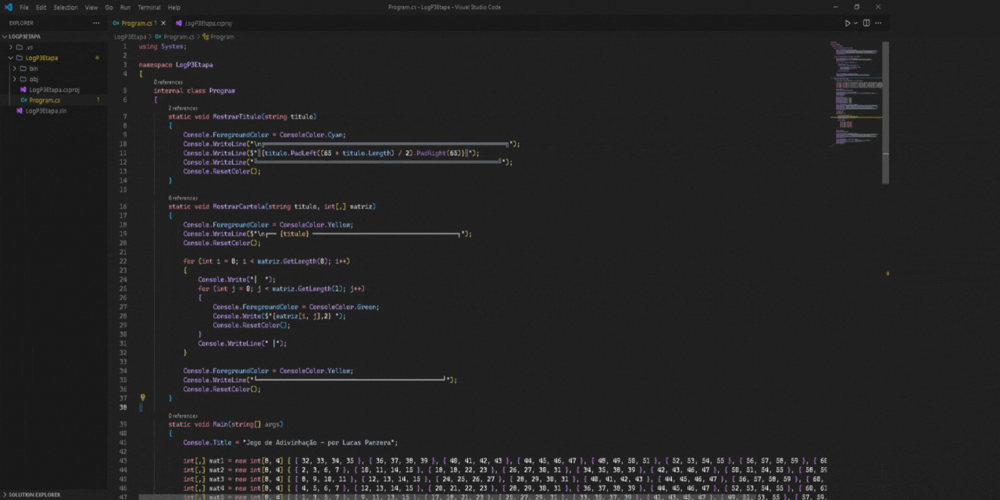

# GuessTheNumberGame 🤔
 </br>
Um jogo interativo de adivinhação, feito em Console C#.



Este é um jogo interativo de adivinhação, onde o usuário escolhe um número entre 1 e 63. O jogo apresenta seis cartelas contendo diferentes combinações de números. O objetivo do jogador é indicar em quais cartelas o número escolhido aparece. Com base nas escolhas do jogador, o jogo utiliza lógica para adivinhar o número em que ele pensou. É uma experiência divertida e simples que demonstra como a manipulação de dados pode ser aplicada em jogos de adivinhação.

Explicação da adivinhação do número por cartelas: https://www.youtube.com/watch?v=I9yxHpcVRKU

## Tecnologias Utilizadas 🛠️
<div align="left">
  
  
</div></BR>

## 🎮 Como Jogar
```bash
Acesse: https://replit.com/@lucassouzapanze/GuessTheNumberGame

1. Clique no botão verde **"Run"** no topo da página
2. Aguarde o console carregar (tela preta à direita)
3. Pense em um número entre 1 e 63
4. Pressione ENTER para continuar
5. Olhe cada cartela exibida (1 a 6)
6. Digite o número de cada cartela onde seu número aparece
7. Digite 9 quando terminar de informar todas as cartelas
8. O programa irá revelar o número que você pensou!

## 🎯 Exemplo:
Se você pensou no número 45:
- Olhe cada cartela
- Digite os números das cartelas onde o 45 aparece
- Digite 9 para finalizar
- O programa mostrará: "O número que você pensou é: 45"

## ⚡ Dicas
- Observe atentamente cada cartela antes de responder
- Se errar, você pode executar novamente clicando em "Run"
- As cartelas são coloridas para facilitar a visualização
- Não se esqueça de digitar 9 para finalizar sua resposta

```

## 🚀 Como Executar o Projeto
```bash
## Acesse
https://replit.com/@lucassouzapanze/GuessTheNumberGame

## OU

# Clone este repositório
$ git clone https://github.com/lucaspanzera1/GuessTheNumberGame.git

# Acesse a pasta do projeto
$ cd GuessTheNumberGame

# No terminal, rode o projeto
dotnet run

# AVISO! Pode ser necessário instalar a extensão "C# Dev Kit" da Microsoft 

```
